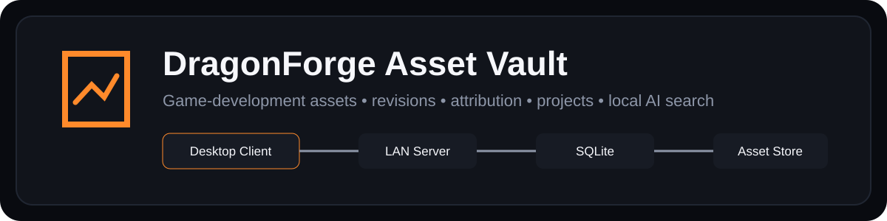
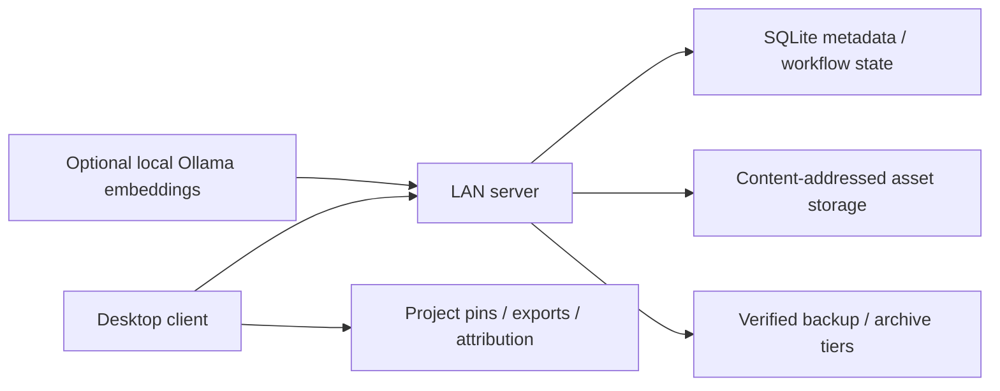

# DragonForge Asset Vault

<p align="center">
  
</p>

DragonForge Asset Vault is a Windows-first, LAN-oriented asset manager for game-development teams and solo projects. It combines source-asset storage, revision history, license/attribution tracking, project pinning, collaboration controls, backups, archive tiers, and AI-assisted search in one desktop workflow.

> **Status:** Phase 18.2 maintenance baseline. The current implementation includes relationship/lineage tracking between assets in addition to the earlier versioning, project, search, collaboration, storage, and audit features.

## What it manages

Asset Vault is designed around the lifecycle of a game-development asset rather than treating files as an unstructured shared folder.

Major capabilities include:

- content-addressed storage with SHA-256 duplicate detection;
- immutable asset revision history;
- single-file and ZIP package imports;
- image and 3D previews;
- categories, tags, package/dependency metadata, and recycle-bin workflows;
- project/version pinning with engine-aware export destinations;
- drift detection, pinned-file repair, and explicit update-to-latest workflows;
- built-in license presets, asset-level license assessment, project-wide reports, and generated attribution files;
- local Ollama semantic embeddings with hybrid semantic + keyword search and offline keyword fallback;
- verified backups with SHA-256 manifests and optional replication targets;
- hot/archive storage tiers with verified movement and transparent read access;
- authenticated Administrator / Developer / Read-only roles;
- asset check-out/check-in and server-enforced collaboration locks;
- append-only activity/audit history with searchable filters and export;
- directional relationships for variants, derivatives, LODs, collisions, materials, textures, animations, engine exports, and references.

## Desktop workflow

The client uses a three-region layout:

```text
Navigation sidebar | Searchable asset list | Asset detail workspace
```

The main views cover Assets, Recycle Bin, Projects, Activity, Backups, AI Search, Users, and Settings. Project-scoped browsing keeps the normal asset detail workspace while showing pinned version, current/latest revision state, and export path for each project asset.

Read-only users can inspect assets, versions, previews, project state, activity, and relationships without being presented with mutation controls they are not authorized to use. Server-side authorization remains authoritative.

### Workflow at a glance



### Screenshots

The current repository does not contain a dedicated public screenshot pack, and the connector environment cannot run the real desktop/server stack. No screenshot is fabricated. The required synthetic asset-library, detail, project, and optional AI-search captures are defined in [Public Screenshot Capture](docs/PUBLIC_SCREENSHOT_CAPTURE.md).

## Project integration and attribution

When licensed assets are registered to a project, Asset Vault can maintain:

```text
<Project>/
├── CREDITS.txt
├── DragonForge-License-Manifest.json
├── DragonForge-License-Manifest.csv
└── <engine-specific asset directory>/
```

Built-in project presets include Generic, Godot, Unity, Unreal Engine, Roblox/Rojo, and Minecraft Bedrock. Project pins preserve the selected asset revision until an explicit update is requested.

License presets currently include `CC0-1.0`, `CC-BY-4.0`, `Custom`, and `Unknown`. Custom or site-specific licenses remain marked for manual review rather than being automatically interpreted as legally compatible.

Asset Vault helps track license information and generate attribution material; it is not a legal-license compatibility oracle.

## Architecture

The application consists of a Rust LAN server and native desktop client backed by SQLite and filesystem storage.

The server owns asset metadata, revisions, hashes, authorization, checkouts, audit history, project state, backup/catalog operations, and the storage-tier rules. Binary data is stored on the filesystem while catalog and workflow state are persisted in SQLite.

Optional AI search uses a local Ollama service, defaulting to `http://127.0.0.1:11434` with `nomic-embed-text`. Smart Search falls back to keyword ranking when Ollama is unavailable.

The live vault data directory, database, previews, asset binaries, backups, and client/server logs are runtime data and are not intended to live in Git.

## Quick start

Start the server:

```powershell
cargo run --release --bin dragonforge-server
```

Then start the desktop client:

```powershell
cargo run --release --bin dragonforge-client
```

For AI-assisted search, install Ollama separately and pull the configured embedding model, for example:

```powershell
ollama pull nomic-embed-text
```

Then use **Reindex AI Search** from the desktop client.

Configuration examples are available in [`DragonForge.example.toml`](DragonForge.example.toml). Keep live tokens, databases, backup data, and runtime storage outside the tracked repository.

## Security and operating boundaries

Asset Vault is designed primarily for trusted LAN/self-hosted workflows. Authentication and role enforcement strengthen that model, but operators should still treat the server, storage roots, backups, and administrator tokens as sensitive infrastructure.

- API-token authentication is optional and should use long random tokens when enabled.
- Only token hashes are stored in SQLite, but clients still need to protect their configured token.
- Archive and backup destinations must remain outside the live data directory.
- Check-out ownership prevents conflicting mutations but is not a distributed source-control replacement.
- Semantic search depends on the locally configured model/service; AI results are search aids, not authoritative metadata.
- License/attribution features organize project information but do not replace human/legal review of uncertain licenses.
- The project is still an actively developed engineering tool rather than a formally audited enterprise content-management system.

## Documentation

- [`docs/`](docs/) — complete phase-by-phase engineering and validation history
- [Phase 16 desktop redesign](docs/PHASE_16.md) — modern client shell and workspace organization
- [Public Screenshot Capture](docs/PUBLIC_SCREENSHOT_CAPTURE.md) — synthetic/demo asset capture and sanitization rules
- [Third-party notices](THIRD_PARTY_NOTICES.md) — dependency/license review requirements
- [License](LICENSE) — current DragonForge proprietary source notice
- [Contribution policy](CONTRIBUTING.md) — current external-contribution boundary

The detailed Phase 1–18.2 implementation record remains under `docs/`; this README focuses on the current product and evaluation path rather than repeating the build diary.

## Publication and dependency limitations

The current DragonForge source is proprietary/source-visible. Earlier copies validly distributed under the repository's former MIT license retain the rights granted to those copies; the current licensing change does not revoke historical grants.

The repository did not contain a committed `Cargo.lock` at the Phase 3 public-readiness audit. Before public binary distribution, the exact Cargo dependency graph still needs to be frozen and its complete transitive license metadata reviewed. This README does not imply that publication gate has been resolved.

## Personal / Portfolio Use Disclaimer

This repository is maintained for my personal projects, learning, evaluation, and portfolio demonstration. It is not intended or offered as a commercial product, managed service, professional consulting service, certification, warranty, or guarantee of fitness for any particular purpose.

Any third party who chooses to compile, run, adapt, evaluate, or otherwise use material from this repository does so entirely at their own risk and is responsible for ensuring that their use is lawful, appropriate for their environment, and compliant with applicable licenses and third-party terms.

To the maximum extent permitted by applicable law, I assume no responsibility or liability for loss, damage, data loss, service interruption, security incidents, system changes, misuse, legal or regulatory consequences, or any other outcome arising from another person's use of or reliance on this repository or its materials.

This disclaimer does not expand the permissions granted by the repository's license. The licensing terms below continue to control whether and how the material may be used.

## Licensing

Copyright © 2026 David James. All rights reserved.

Original DragonForge material in this repository is **source-visible, not open source**. Except for rights expressly required by GitHub's Terms of Service for public repositories, no general permission is granted to use, copy, modify, redistribute, sublicense, sell, commercially exploit, or incorporate original DragonForge material into another work.

See [LICENSE](LICENSE) for the full notice. Third-party components retain their own licenses and rights; see [THIRD_PARTY_NOTICES.md](THIRD_PARTY_NOTICES.md).
